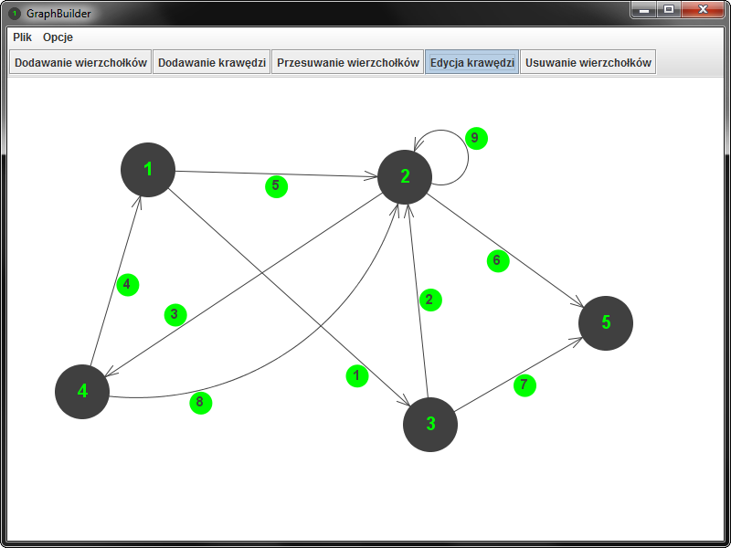

# GraphBuilder
Graphical tool written in Java that allows drawing different types of graphs and export them to clipboard as matrices in different formats (including MathML accepted by MS Word in equations editor).

Check out [this instruction](docs/instrukcja.pdf) for details (Polish only).

